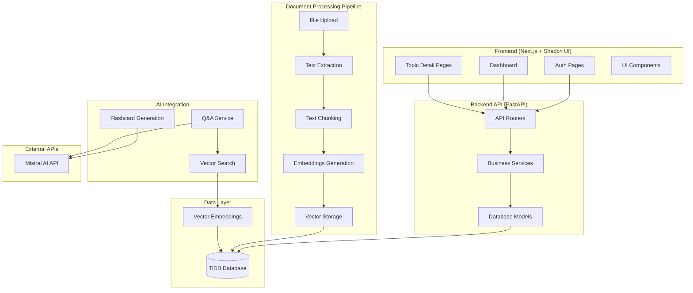

# Healthcare Study Companion - Remaining Implementation & Async Enhancement - Design Document

## Overview

This design document outlines the architecture and implementation approach for completing the Healthcare Study Companion application. Based on analysis of the existing codebase, we have a solid foundation with FastAPI backend, comprehensive models, and basic async support. This design focuses on completing the missing features while enhancing async processing capabilities.

## Current Architecture Analysis

### Existing Components (Already Implemented)

**Backend (FastAPI):**
- ✅ Comprehensive models: User, Topic, Document, QAHistory, Flashcard, StudySession, etc.
- ✅ Authentication system with JWT
- ✅ Basic async routers: topics, qa, flashcards, study_sessions, progress, llm, documents
- ✅ LLM and embeddings services (Mistral API integration)
- ✅ Spaced repetition algorithm
- ✅ Database configuration with TiDB support

**Frontend (Next.js):**
- ✅ Basic scaffold with App Router
- ✅ Shadcn UI components setup
- ✅ API client with authentication
- ✅ Confirmation dialog system

### Target Architecture



### Component Design

#### 1. Document Processing Pipeline

**Purpose**: Complete the document ingestion workflow from upload to searchable content

**Components**:
- `DocumentProcessor`: Orchestrates the entire processing pipeline
- `TextExtractor`: Extracts text from PDFs and other document formats
- `TextChunker`: Splits documents into manageable chunks with overlap
- `EmbeddingGenerator`: Generates vector embeddings for chunks (already exists)
- `VectorStore`: Stores and indexes embeddings for search

**Implementation**:
```python
class DocumentProcessor:
    async def process_document(self, document: Document) -> None:
        try:
            # Extract text from uploaded file
            text = await self.text_extractor.extract(document.file_path)
            
            # Chunk the text into manageable pieces
            chunks = await self.text_chunker.chunk(text, document.id)
            
            # Generate embeddings for each chunk
            embeddings = await self.embedding_generator.generate_batch(
                [chunk.text for chunk in chunks]
            )
            
            # Store chunks and embeddings
            await self.vector_store.store_chunks(chunks, embeddings)
            
            # Update document status
            document.status = DocumentStatus.PROCESSED
            await self.db.commit()
            
        except Exception as e:
            document.status = DocumentStatus.ERROR
            document.error_message = str(e)
            await self.db.commit()
```

#### 2. Vector Search System

**Purpose**: Enable semantic search across document content

**Components**:
- `VectorSearchService`: Performs similarity search using embeddings
- `SearchRanker`: Ranks and filters search results by relevance
- `ContextRetriever`: Retrieves relevant context for Q&A operations

**Implementation**:
```python
class VectorSearchService:
    async def search(
        self, 
        query: str, 
        topic_id: int, 
        limit: int = 10
    ) -> List[SearchResult]:
        # Generate embedding for the query
        query_embedding = await self.embedding_service.embed_texts([query])
        
        # Find similar chunks using cosine similarity
        similar_chunks = await self.db.execute(
            select(DocumentChunk)
            .join(Document)
            .where(Document.topic_id == topic_id)
            .order_by(
                func.cosine_similarity(
                    DocumentChunk.embedding, 
                    query_embedding[0]
                ).desc()
            )
            .limit(limit)
        )
        
        return [
            SearchResult(
                chunk=chunk,
                score=self.calculate_similarity(query_embedding[0], chunk.embedding),
                document=chunk.document
            )
            for chunk in similar_chunks
        ]
```

#### 3. Enhanced AI Integration

**Purpose**: Improve existing AI services with better context retrieval and error handling

**Components**:
- `EnhancedQAService`: Combines vector search with LLM for better answers
- `FlashcardGenerator`: Creates flashcards from document content
- `AIErrorHandler`: Manages rate limiting and retry logic

**Implementation**:
```python
class EnhancedQAService:
    async def answer_question(
        self, 
        question: str, 
        topic_id: int
    ) -> QAResponse:
        # Retrieve relevant context using vector search
        search_results = await self.vector_search.search(
            query=question,
            topic_id=topic_id,
            limit=5
        )
        
        # Prepare context for LLM
        context = "\n\n".join([
            f"Source: {result.document.filename}\n{result.chunk.text}"
            for result in search_results
        ])
        
        # Generate answer using LLM with context
        try:
            answer = await self.llm_service.generate_answer(
                question=question,
                context_chunks=[context],
                temperature=0.7
            )
            
            return QAResponse(
                answer=answer,
                sources=search_results,
                confidence=self.calculate_confidence(search_results)
            )
            
        except Exception as e:
            return await self.error_handler.handle_ai_error(e, question)
```

#### 4. Frontend Application Architecture

**Purpose**: Complete user interface for all application functionality

**Components**:
- `AuthenticationPages`: Login, signup, password reset
- `Dashboard`: Topic management and overview
- `TopicDetailPages`: Document upload, Q&A, flashcards
- `SharedComponents`: Navigation, forms, modals

**Key Pages**:
```typescript
// App structure
/app
  /auth
    /login/page.tsx
    /signup/page.tsx
  /dashboard
    /page.tsx                    // Topics list
    /[topicId]
      /page.tsx                  // Topic detail
      /documents/page.tsx        // Document management
      /flashcards/page.tsx       // Flashcard review
      /qa/page.tsx              // Q&A interface
  /components
    /ui/                         // Shadcn components
    /forms/                      // Form components
    /navigation/                 // Nav components
```

## Data Models

### Task Management Models

```python
class BackgroundTask(Base):
    __tablename__ = "background_tasks"
    
    id = Column(String, primary_key=True)  # UUID
    task_type = Column(String, nullable=False)
    status = Column(Enum(TaskStatus), default=TaskStatus.PENDING)
    priority = Column(Integer, default=0)
    user_id = Column(Integer, ForeignKey("users.id"))
    
    # Task data and configuration
    task_data = Column(JSON)
    task_config = Column(JSON)
    
    # Progress tracking
    progress_current = Column(Integer, default=0)
    progress_total = Column(Integer, default=100)
    progress_message = Column(String)
    
    # Timing information
    created_at = Column(DateTime, default=datetime.utcnow)
    started_at = Column(DateTime)
    completed_at = Column(DateTime)
    
    # Error handling
    error_count = Column(Integer, default=0)
    last_error = Column(Text)
    
    # Result storage
    result_data = Column(JSON)

class TaskExecution(Base):
    __tablename__ = "task_executions"
    
    id = Column(Integer, primary_key=True)
    task_id = Column(String, ForeignKey("background_tasks.id"))
    worker_id = Column(String)
    
    started_at = Column(DateTime, default=datetime.utcnow)
    completed_at = Column(DateTime)
    
    status = Column(Enum(ExecutionStatus))
    error_message = Column(Text)
    execution_time_ms = Column(Integer)
    
    # Performance metrics
    cpu_usage = Column(Float)
    memory_usage = Column(Float)
    
class WebSocketConnection(Base):
    __tablename__ = "websocket_connections"
    
    id = Column(String, primary_key=True)  # Connection ID
    user_id = Column(Integer, ForeignKey("users.id"))
    
    connected_at = Column(DateTime, default=datetime.utcnow)
    last_ping = Column(DateTime, default=datetime.utcnow)
    
    # Connection metadata
    user_agent = Column(String)
    ip_address = Column(String)
    
    # Subscription management
    subscribed_topics = Column(JSON)  # List of topic IDs
    subscribed_events = Column(JSON)  # List of event types
```

## Components and Interfaces

### 1. Async Document Processing

```python
class AsyncDocumentProcessor:
    async def process_documents_batch(
        self, 
        documents: List[Document], 
        user_id: int
    ) -> List[ProcessingResult]:
        """Process multiple documents concurrently"""
        
    async def extract_text_async(self, document: Document) -> str:
        """Extract text from document using async processing"""
        
    async def generate_embeddings_batch(
        self, 
        texts: List[str]
    ) -> List[List[float]]:
        """Generate embeddings for multiple texts concurrently"""
        
    async def chunk_and_store_async(
        self, 
        document: Document, 
        text: str
    ) -> List[DocumentChunk]:
        """Chunk document and store with async database operations"""
```

### 2. AI Service with Concurrency

```python
class AsyncAIService:
    def __init__(self, max_concurrent_requests: int = 10):
        self.semaphore = asyncio.Semaphore(max_concurrent_requests)
        self.rate_limiter = RateLimiter()
        
    async def generate_answer_async(
        self, 
        question: str, 
        context: List[str]
    ) -> AIResponse:
        """Generate AI answer with rate limiting and concurrency control"""
        
    async def generate_flashcards_batch(
        self, 
        topics: List[Topic]
    ) -> List[List[Flashcard]]:
        """Generate flashcards for multiple topics concurrently"""
        
    async def process_ai_queue(self) -> None:
        """Process queued AI requests with priority handling"""
```

### 3. WebSocket Event System

```python
class WebSocketEventManager:
    async def broadcast_to_user(
        self, 
        user_id: int, 
        event: Event
    ) -> None:
        """Send event to all connections for a specific user"""
        
    async def broadcast_to_topic(
        self, 
        topic_id: int, 
        event: Event
    ) -> None:
        """Send event to all users subscribed to a topic"""
        
    async def handle_connection(
        self, 
        websocket: WebSocket, 
        user_id: int
    ) -> None:
        """Handle new WebSocket connection with proper cleanup"""
        
    async def cleanup_stale_connections(self) -> None:
        """Remove inactive connections periodically"""
```

### 4. Background Task System

```python
class BackgroundTaskManager:
    async def submit_task(
        self, 
        task_type: str, 
        task_data: dict, 
        user_id: int,
        priority: int = 0
    ) -> str:
        """Submit a new background task"""
        
    async def get_task_status(self, task_id: str) -> TaskStatus:
        """Get current status of a background task"""
        
    async def cancel_task(self, task_id: str) -> bool:
        """Cancel a running or queued task"""
        
    async def retry_failed_task(self, task_id: str) -> bool:
        """Retry a failed task with exponential backoff"""
```

## Error Handling

### Error Categories and Strategies

1. **Transient Errors** (Network timeouts, temporary service unavailability)
   - Retry with exponential backoff
   - Circuit breaker pattern
   - Fallback mechanisms

2. **Resource Exhaustion** (Memory, CPU, database connections)
   - Graceful degradation
   - Load shedding
   - Resource throttling

3. **Data Consistency Errors** (Database deadlocks, concurrent modifications)
   - Transaction retry logic
   - Optimistic locking
   - Conflict resolution strategies

4. **External Service Errors** (AI API failures, email service issues)
   - Service health monitoring
   - Automatic failover
   - Queue-based retry mechanisms

### Error Recovery Patterns

```python
class ErrorRecoveryManager:
    async def handle_transient_error(
        self, 
        error: Exception, 
        operation: Callable,
        max_retries: int = 3
    ) -> Any:
        """Handle transient errors with exponential backoff"""
        
    async def handle_resource_exhaustion(
        self, 
        resource_type: str
    ) -> None:
        """Implement load shedding and resource throttling"""
        
    async def handle_data_consistency_error(
        self, 
        error: Exception, 
        transaction: Callable
    ) -> Any:
        """Handle database consistency issues"""
```

## Testing Strategy

### 1. Unit Testing for Async Code

```python
class AsyncTestCase(unittest.TestCase):
    def setUp(self):
        self.loop = asyncio.new_event_loop()
        asyncio.set_event_loop(self.loop)
        
    def tearDown(self):
        self.loop.close()
        
    async def test_concurrent_document_processing(self):
        """Test concurrent document processing"""
        
    async def test_ai_service_rate_limiting(self):
        """Test AI service rate limiting and queuing"""
        
    async def test_websocket_broadcasting(self):
        """Test WebSocket event broadcasting"""
```

### 2. Integration Testing

```python
class IntegrationTestSuite:
    async def test_end_to_end_document_workflow(self):
        """Test complete document processing workflow"""
        
    async def test_concurrent_user_sessions(self):
        """Test multiple users using the system simultaneously"""
        
    async def test_system_recovery_after_failure(self):
        """Test system recovery after various failure scenarios"""
```

### 3. Load Testing

```python
class LoadTestRunner:
    async def simulate_concurrent_uploads(
        self, 
        num_users: int, 
        files_per_user: int
    ):
        """Simulate concurrent document uploads"""
        
    async def simulate_ai_request_burst(
        self, 
        num_requests: int, 
        request_rate: float
    ):
        """Simulate burst of AI requests"""
        
    async def measure_websocket_performance(
        self, 
        num_connections: int, 
        messages_per_second: int
    ):
        """Measure WebSocket performance under load"""
```

### 4. Performance Monitoring

```python
class PerformanceMonitor:
    async def collect_async_metrics(self) -> Dict[str, Any]:
        """Collect performance metrics for async operations"""
        
    async def monitor_resource_usage(self) -> ResourceUsage:
        """Monitor CPU, memory, and database connection usage"""
        
    async def generate_performance_report(self) -> PerformanceReport:
        """Generate comprehensive performance report"""
```

## Configuration Management

### Threading and Concurrency Configuration

```python
class ThreadingConfig:
    # Database connection pool settings
    DB_POOL_SIZE: int = 20
    DB_MAX_OVERFLOW: int = 30
    DB_POOL_TIMEOUT: int = 30
    
    # Async operation limits
    MAX_CONCURRENT_AI_REQUESTS: int = 10
    MAX_CONCURRENT_DOCUMENT_PROCESSING: int = 5
    MAX_CONCURRENT_WEBSOCKET_CONNECTIONS: int = 1000
    
    # Task queue settings
    TASK_QUEUE_SIZE: int = 1000
    TASK_WORKER_COUNT: int = 4
    TASK_RETRY_MAX_ATTEMPTS: int = 3
    TASK_RETRY_BACKOFF_FACTOR: float = 2.0
    
    # WebSocket settings
    WEBSOCKET_PING_INTERVAL: int = 30
    WEBSOCKET_PING_TIMEOUT: int = 10
    WEBSOCKET_MESSAGE_BUFFER_SIZE: int = 100
    
    # Performance monitoring
    METRICS_COLLECTION_INTERVAL: int = 60
    PERFORMANCE_ALERT_THRESHOLDS: Dict[str, float] = {
        "cpu_usage": 80.0,
        "memory_usage": 85.0,
        "db_connection_usage": 90.0
    }
```

## Security Considerations

### 1. WebSocket Security
- Authentication token validation for WebSocket connections
- Rate limiting for WebSocket messages
- Input validation for all WebSocket events
- Connection limits per user

### 2. Background Task Security
- Task isolation between users
- Resource limits for background tasks
- Secure handling of sensitive data in task payloads
- Audit logging for all background operations

### 3. Concurrent Access Security
- Proper authorization checks in async operations
- Data isolation in concurrent database operations
- Secure handling of shared resources
- Prevention of race conditions in security-critical operations

## Deployment Considerations

### 1. Infrastructure Requirements
- Redis for task queuing and caching
- WebSocket-capable load balancer
- Monitoring and alerting system
- Log aggregation for distributed operations

### 2. Scaling Strategy
- Horizontal scaling of background workers
- Database read replicas for improved performance
- CDN for static file serving
- Auto-scaling based on queue depth and resource usage

### 3. Monitoring and Observability
- Distributed tracing for async operations
- Real-time dashboards for system health
- Alerting for performance degradation
- Comprehensive logging for debugging

This design provides a robust foundation for implementing threading and testing capabilities while maintaining system reliability and performance.