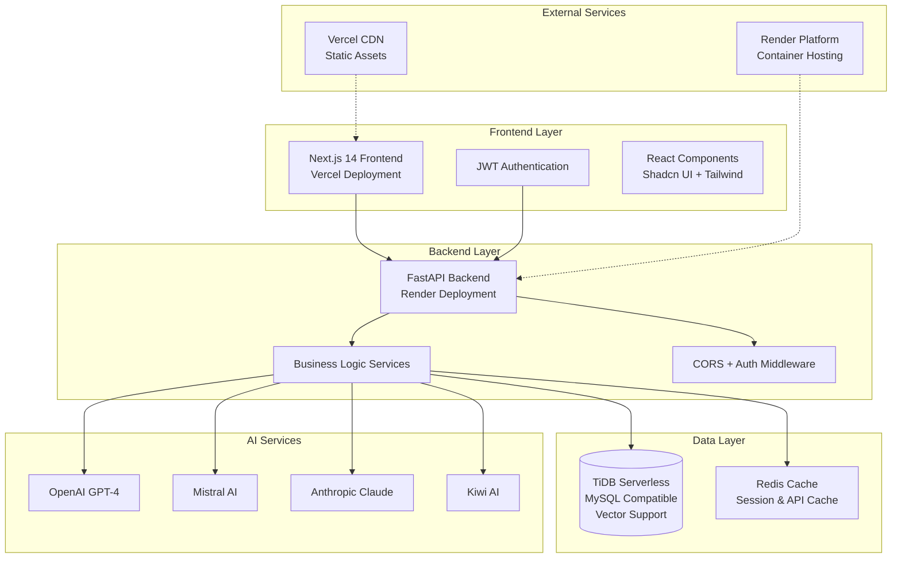
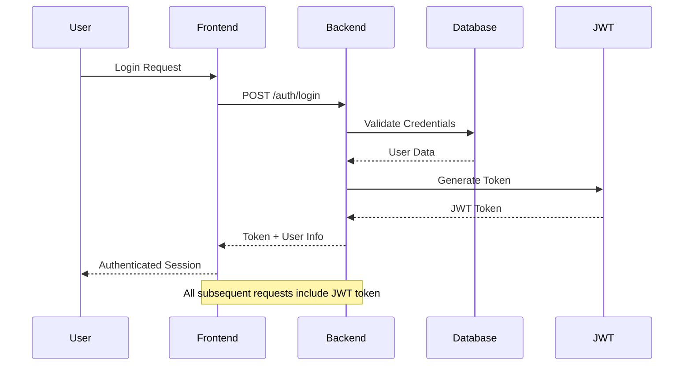
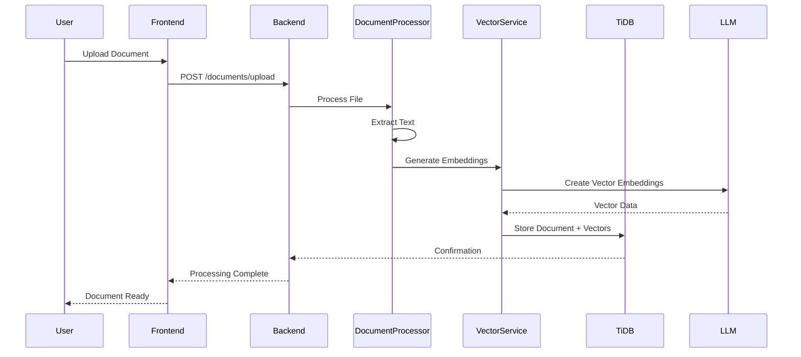
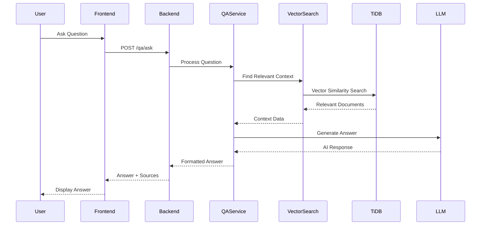
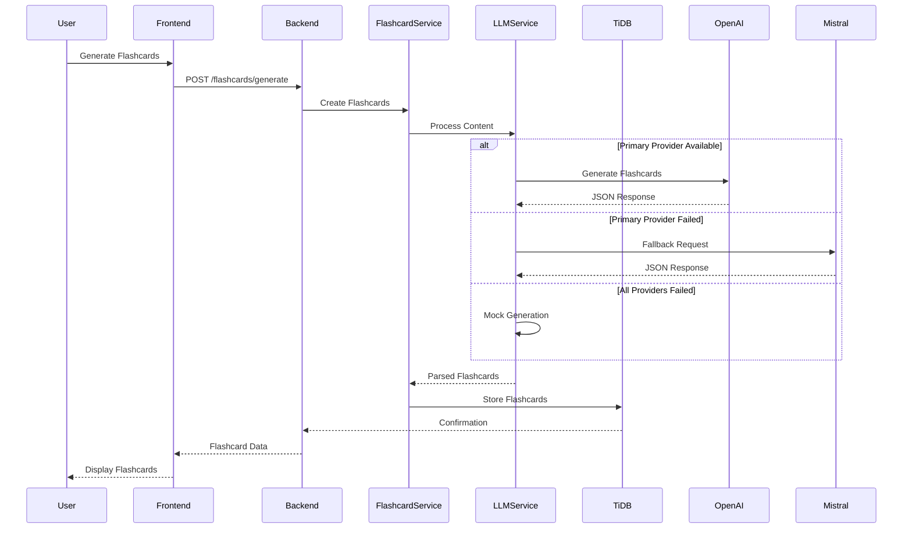

# Healthcare Study Companion - Data Flow and Integrations

## Overview

The Healthcare Study Companion is a comprehensive study management platform designed for healthcare students and professionals. It leverages AI-powered learning tools, document management, and vector search capabilities to enhance the learning experience.

## Architecture Overview



## Core Data Flows

### 1. User Authentication Flow



### 2. Document Processing Pipeline



### 3. AI-Powered Q&A Flow



### 4. Flashcard Generation Flow



## Key Integrations

### Database Integration (TiDB Serverless)

**Connection Details:**

- **Type**: MySQL-compatible with vector extensions
- **Features**: ACID transactions, vector similarity search, horizontal scaling
- **Connection**: SQLAlchemy ORM with connection pooling

**Data Models:**

```python
# Core entities stored in TiDB
- Users (authentication, profiles)
- Topics (study organization)
- Documents (file metadata, processed text)
- DocumentChunks (text segments with vector embeddings)
- Flashcards (generated study materials)
- StudySessions (learning progress tracking)
- QAHistory (question-answer pairs)
```

**Vector Search Capabilities:**

```sql
-- Example vector similarity search
SELECT document_id, content,
       VEC_COSINE_DISTANCE(embedding, ?) as similarity
FROM document_chunks
WHERE VEC_COSINE_DISTANCE(embedding, ?) < 0.3
ORDER BY similarity ASC
LIMIT 10;
```

### AI Service Integration

**Multi-Provider LLM Setup:**

```python
# Provider fallback chain
PRIMARY_PROVIDERS = [
    "openai",      # GPT-4, GPT-3.5-turbo
    "mistral",     # Mistral-7B, Mistral-Small
    "anthropic",   # Claude-3, Claude-2
    "kiwi"         # Kiwi AI models
]

# Automatic failover logic
class LLMService:
    async def generate_with_fallback(self, prompt: str):
        for provider in self.providers:
            try:
                return await self.call_provider(provider, prompt)
            except AuthenticationError:
                continue  # Try next provider
            except RateLimitError:
                await self.backoff_delay()
                continue

        # All providers failed - use mock response
        return self.generate_mock_response(prompt)
```

**API Integration Details:**

- **OpenAI**: GPT-4 for complex reasoning, GPT-3.5-turbo for speed
- **Mistral**: Cost-effective alternative with good performance
- **Anthropic**: Claude for nuanced medical content understanding
- **Kiwi AI**: Specialized healthcare domain models

### Deployment Integrations

**Frontend (Vercel):**

```yaml
# vercel.json configuration
{
  "framework": "nextjs",
  "buildCommand": "npm run build",
  "outputDirectory": ".next",
  "env":
    {
      "NEXT_PUBLIC_API_URL": "https://healthcare-backend.onrender.com",
      "NEXT_PUBLIC_ENVIRONMENT": "production",
    },
  "headers":
    [
      {
        "source": "/(.*)",
        "headers":
          [
            { "key": "X-Content-Type-Options", "value": "nosniff" },
            { "key": "X-Frame-Options", "value": "SAMEORIGIN" },
            { "key": "X-XSS-Protection", "value": "1; mode=block" },
          ],
      },
    ],
}
```

**Backend (Render):**

```yaml
# render.yaml configuration
services:
  - type: web
    name: healthcare-study-backend
    env: python
    buildCommand: "pip install -r requirements.txt"
    startCommand: "uvicorn app.main:app --host 0.0.0.0 --port $PORT"
    healthCheckPath: "/healthz"
    envVars:
      - key: DATABASE_URL
        fromDatabase:
          name: healthcare-tidb
          property: connectionString
      - key: OPENAI_API_KEY
        sync: false
      - key: JWT_SECRET
        generateValue: true
```

## Data Security and Privacy

### Authentication & Authorization

```python
# JWT-based authentication
class JWTAuth:
    def create_token(self, user_id: str) -> str:
        payload = {
            "user_id": user_id,
            "exp": datetime.utcnow() + timedelta(hours=24),
            "iat": datetime.utcnow()
        }
        return jwt.encode(payload, settings.jwt_secret, algorithm="HS256")

    def verify_token(self, token: str) -> dict:
        return jwt.decode(token, settings.jwt_secret, algorithms=["HS256"])
```

### Data Encryption

- **In Transit**: HTTPS/TLS 1.3 for all API communications
- **At Rest**: TiDB native encryption for sensitive data
- **API Keys**: Environment variables with rotation capability

### CORS Configuration

```python
# Production CORS settings
CORS_ORIGINS = [
    "https://healthcare-study-companion.vercel.app",
    "https://*.vercel.app",  # Preview deployments
]

# Development origins (non-production only)
if settings.environment != "production":
    CORS_ORIGINS.extend([
        "http://localhost:3000",
        "http://127.0.0.1:3000"
    ])
```

## Performance Optimizations

### Frontend Optimizations

```typescript
// Code splitting and lazy loading
const FlashcardInterface = lazy(() => import("./flashcard-interface"));
const DocumentUpload = lazy(() => import("./document-upload"));

// API response caching
const apiCache = new Map<string, CachedResponse>();

// Progressive loading for large datasets
const usePagination = (pageSize: number = 20) => {
  // Implementation for virtual scrolling
};
```

### Backend Optimizations

```python
# Database connection pooling
DATABASE_CONFIG = {
    "pool_size": 20,
    "max_overflow": 30,
    "pool_timeout": 30,
    "pool_recycle": 3600
}

# Background task processing
class TaskQueue:
    async def process_document_async(self, document_id: str):
        # Async document processing
        pass

    async def generate_flashcards_async(self, content: str):
        # Background flashcard generation
        pass
```

## Monitoring and Observability

### Health Checks

```python
@app.get("/healthz")
async def health_check():
    return {
        "status": "healthy",
        "timestamp": datetime.utcnow(),
        "version": "1.0.0",
        "services": {
            "database": await check_database_health(),
            "llm_providers": await check_llm_providers(),
            "cache": await check_cache_health()
        }
    }
```

### Error Tracking

```python
class ErrorTracker:
    def log_error(self, error: Exception, context: dict):
        error_data = {
            "error_id": str(uuid.uuid4()),
            "error_type": type(error).__name__,
            "message": str(error),
            "context": context,
            "timestamp": datetime.utcnow(),
            "stack_trace": traceback.format_exc()
        }
        # Send to monitoring service
```

## API Endpoints Summary

### Authentication

- `POST /auth/signup` - User registration
- `POST /auth/login` - User authentication
- `POST /auth/refresh` - Token refresh
- `POST /auth/logout` - Session termination

### Topics Management

- `GET /topics/` - List user topics
- `POST /topics/` - Create new topic
- `GET /topics/{id}` - Get topic details
- `PUT /topics/{id}` - Update topic
- `DELETE /topics/{id}` - Delete topic

### Document Management

- `POST /documents/upload` - Upload document
- `GET /documents/` - List documents
- `GET /documents/{id}` - Get document details
- `DELETE /documents/{id}` - Delete document
- `POST /documents/{id}/process` - Process document

### AI Features

- `POST /qa/ask` - Ask question
- `GET /qa/history` - Get Q&A history
- `POST /flashcards/generate` - Generate flashcards
- `GET /flashcards/` - List flashcards
- `POST /search/semantic` - Semantic search

### System

- `GET /healthz` - Health check
- `GET /metrics` - System metrics
- `GET /docs` - API documentation

## Future Enhancements

### Planned Integrations

1. **Real-time Collaboration**: WebSocket integration for shared study sessions
2. **Mobile App**: React Native app with offline sync
3. **Advanced Analytics**: Learning progress analytics and insights
4. **Third-party Integrations**: Canvas LMS, Google Classroom integration
5. **Voice Features**: Speech-to-text for voice questions and answers

### Scalability Considerations

- **Horizontal Scaling**: TiDB's native horizontal scaling capabilities
- **CDN Integration**: Global content delivery for document assets
- **Microservices**: Potential split into specialized services
- **Event-Driven Architecture**: Message queues for async processing

This architecture provides a robust, scalable foundation for the Healthcare Study Companion, leveraging modern technologies and best practices for performance, security, and user experience.
